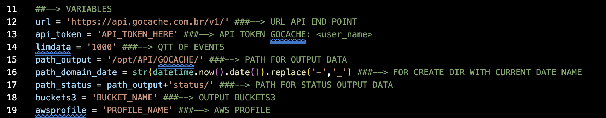
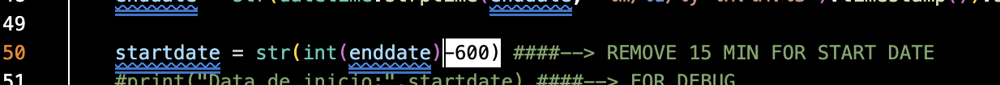

# LogSteam  
> For get logs in GOCACHE API for free.   
#   
[](https://dribbble.com/AgustianES "Imagem by: AgustianES")
#   
This script was created due to the lack of resources available to the information security team where I work in order to achieve some PCI DSS requirements it is necessary to constantly monitor their applications, so what this script does is collect the WAF and FIREWALL logs from Gocache.  
Notice that Gocache has a perfect solution for this called [Log Stream](https://docs.gocache.com.br/api/api_log_stream/ "logstream doc").  
I strongly recommend that you purchase this product to collect the logs more efficiently, but if you are having financial problems like me, you can use ```LogSteam``` for this purpose.   
## Preparing the Environment  
For continuous execution of the **logsteam** I use a **cron job** scheduled with **crontab**, it runs the **logsteam** every ```X``` minutes which collects the logs in the Gocache every ```Y,Z``` time range.  
### Configure cron:   
> [crontab.guru](https://crontab.guru/#*/5_*_*_*_*)   
```bash
$ crontab -e
```
```
*/5 * * * * /opt/logsteam/logsteam.py
```
```bash
$ service cron restart
$ service cron status
$ systemctl enable cron
```  
### Configure output data:   
> https://docs.aws.amazon.com/cli/index.html   
> https://docs.aws.amazon.com/AmazonS3/latest/userguide/creating-bucket.html   

The SIEM solution I currently use is collecting data from a BucketS3, so an AWS key pair is needed to send the logs to a BucketS3.  
* AWS CLI - Configure profile:  
```bash
$ sudo apt install awscli -y
$ aws configure --profile logsteam
```  
## Variables:  
Now let's talk about the logsteam variables:  
#   
[]()
#   
From line ```11``` to ```19``` the logsteam variables are configured.   

On line ```12``` we have the gocache API endpoint, more about that [here](https://docs.gocache.com.br/api/).   

On line ```13``` the gocache API token is set, you must generate this with a user administrator on the platform, you can do this directly in the gocache console GUI or via [terminal](https://docs.gocache.com.br/api/api_token_de_api/).   

Line ```14``` is the event limit we will request from the API.  

Line ```15``` is the output directory that logsteam will store the ```.json``` containing the **WAF** and **FIREWALL** data from the API.  

Line ```16``` is a date tag to create a folder with the current day's date to store and organize the logs.  

Line ```17``` is the status folder, where I store the event IDs to prevent repeated events from going to SIEM.  

Line ```18``` is the name of the bucket3 that we will upload the data to SIEM to collect.  

On line ```19``` we have the name of the awscli profile previously configured.   

### Timestamp setting:    
On line ```50``` of **logsteam**, in the function ```gettimestamp()``` what is happening is that **logsteam** collects the current time and converts it to ```timestamp format``` and adds this value to the variable ```enddate```, then it performs a subtraction calculation on the timestamp of the ```enddate``` and stores the result in the variable ```startdate```, this to adjust the collection of events in the Gocache. Be sure to perform a test on the server to make sure that the timestamp is aligned with the Gocache events:   
#   
[]()
#   
```bash
$ python3
>>> from datetime import datetime  
>>> enddate = datetime.now().date().strftime('%m/%d/%y '+str(datetime.now().time()).split('.')[0])
>>> enddate = str(datetime.strptime(enddate, '%m/%d/%y %H:%M:%S').timestamp()).split('.')[0]
>>> startdate = str(int(enddate)-600)
>>> startdate
'1671683597' 
>>> enddate
'1671684197'
```
Check in: https://timestamp.online   
#   
:frog: